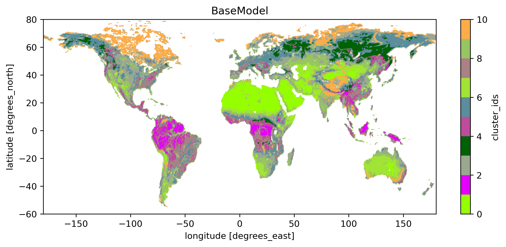
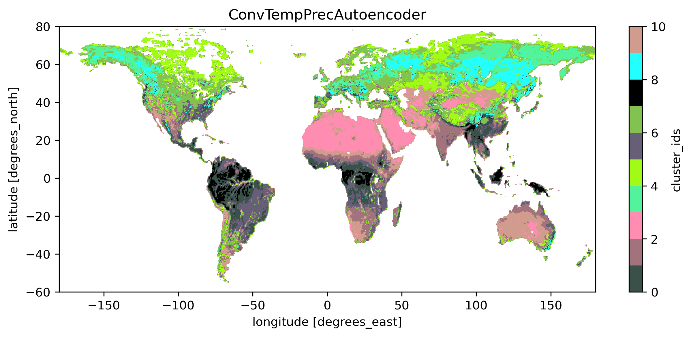

===============
adl_vod_encoder
===============

This project is about automatically extracting features from Vegetation Optical Depth (VOD) time series.
These features are then clustered using a shallow learner (currently k-means) to generate global vegetation clusters.

VOD Preprocessing
===========
https://github.com/Lmoesinger/adl_vod_encoder/blob/main/src/adl_vod_encoder/preprocessing/vodca_preprocessing.py

The original data are daily global images with a quarter degree resolution (1440 x 720 pixels). They range from 1987-08 to 2017-06, but only 1989-01-01 to 2016-12-31 is used as having fully years makes things easier and 1988 has some issues. Values on the southern hemisphere are also shifted by 6 months, so that their seasons align with the northern winter.

The data are downsampled to weekly values and saved in a netcdf stack. There are a few reasons for downsampling:
 - The data has missing values, and by taking weekly means we reduce the number of gaps.
 - The original dataset is quite large (~300GB), downsampled (and by dropping some unnecessary columns) it is at 13.3GB.
 - The original data is quite noisy, therefore sub-weekly variations are more a result of noise rather than the climate.

Auxiliary data Preprocessing
===========
https://github.com/Lmoesinger/adl_vod_encoder/blob/main/src/adl_vod_encoder/preprocessing/era5_preprocessing.py

We also use ERA5 (a climate reanalysis dataset) precipitation and surface temperature, which are traditionally used for vegetation classifications.
We take the temporal means (over the whole time period, resulting in a single global image), which are side tasks for the autoencoder to predict from the encoding.

Normalization/standardization
===========
All data are standardized before feeding it to the network to make them use the whole possible range and centered around 0.

standardized(x) = (x - mean(x)) / std(x)

Autoencoder architecture
===========
https://github.com/Lmoesinger/adl_vod_encoder/blob/main/src/adl_vod_encoder/models/autoencoders.py#L216

Currently, the setup is quite basic:

- The encoder is one Conv layer -> linear layer
- The decoder is one linear layer -> deconvolutional layer

The encoding is also used to predict precipitation and temperature using two linear layers each.
 This forces the encoding to also contain the temperature and precipitation information additional to the vod information. This also works as a regularization, since it forces the autoencoder to produce an encoding  that actually contains information and does not just map every training time series to a specific encoding.
 
Error Metrics for neural network
============
There are three losses: One for reconstructing the VOD time series, and one for predicting the temperature and precipitation each.
I use mean square error everywhere, and weight all errors equally. Therefore, currently:

loss = mse(predicted_vod, original_vod) + mse(predicted_precipitation, target_precipitation) + mse(predicted_temperature, target_temperature)
Currently the temperature and vod loss are very low, while the temperature loss is a lot higher.

Error Metrics for clustering
============
This is a bit difficult as there is no ground truth. While we could make up some metrics like spatial coherence, these cant capture whether the classification makes sense. So it makes more sense to do a qualitative analysis of the clusters. Here are some results:

The first image shows the clusters using only vod data, using the Basemodel (the encoder is just one linear layer bringing it down to the encoding size of 4, and the decoder a linear layerwith the size of the input size):

The colors are done by doing pca on the encoding and using the mean of the first 3 pcs as RGB values (scaled to 0-255). Therefore clusters with similar color also have a similar mean encoding. 

Generally the results are, considering how simple the model is, quite good. Generally we get spatialy coherent regions even tough the model was not given any spatial information. Also, often the clusters make sense, as e.g. all deserts are in one cluster. Still there are a lot weird things that make no sense: Large The tropical cluster (pink) can be found also in high northen latitudes, and the boreal forest cluster (dark green) is also in the subtropics. Part of india is also in the polar (orange) cluster.

The next image is the output when using the ConvTempPrecAutoencoder (minimalistic convolutional encoder which also predicts precipitation and temperature)

This output is a lot better; There are no clusters that exist both in the tropics and the subarctics. Also there is a nice color gradient going between nearby clusters, it never changes between completely opposite colors.

Future changes
===========
Currently the autoencoder also predicts temperature and precipitation, and therefore strictly speaking no longer is one. Therefore I want to get rid of precipitation and temperature. 

The idea is to split the time series into years, and produce an encoding for each year. As the climate does not change drastically over 30 years, we would expect that all years of the same time series should have a similar encoding. Therefore we can then penalize the autoencoder if the encoding differences are large.

Notes for myself
===========
pytochlightning template:
https://github.com/PyTorchLightning/deep-learning-project-template

Note
====

This project has been set up using PyScaffold 3.2.3. For details and usage
information on PyScaffold see https://pyscaffold.org/.
