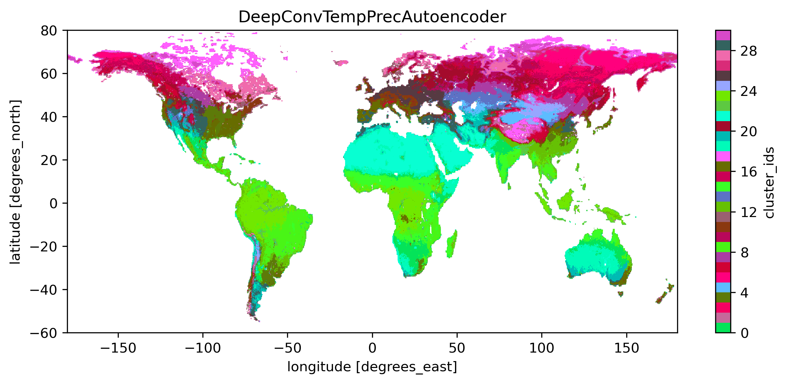
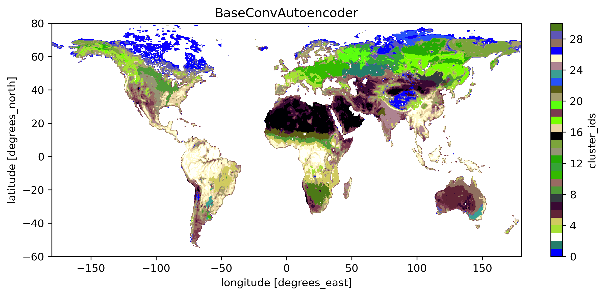

===============
Global Vegetation Clustering using Deep Learning
===============

This project is about automatically extracting features from Vegetation Optical Depth (VOD) time series and auxiliary data.
These features are then clustered using a shallow learner (currently k-means) to generate global vegetation clusters.

VOD Preprocessing
===========
https://github.com/Lmoesinger/adl_vod_encoder/blob/main/src/adl_vod_encoder/preprocessing/vodca_preprocessing.py

The original data are daily global images with a quarter degree resolution (1440 x 720 pixels). They range from 1987-08 to 2017-06, but only 1989-01-01 to 2016-12-31 is used as having fully years makes things easier and 1988 has some issues. Values on the southern hemisphere are also shifted by 6 months, so that their seasons align with the northern hemisphere.

The data are downsampled to weekly values and saved in a netcdf stack. There are a few reasons for downsampling:
 - The data has missing values, and by taking weekly means we reduce the number of gaps.
 - The original dataset is quite large (~300GB), downsampled (and by dropping some unnecessary columns) it is at 13.3GB.
 - The original data is quite noisy, therefore sub-weekly variations are more a result of noise rather than vegetation changes.

Auxiliary data Preprocessing
===========
https://github.com/Lmoesinger/adl_vod_encoder/blob/main/src/adl_vod_encoder/preprocessing/era5_preprocessing.py

We also use ERA5 (a climate reanalysis dataset) precipitation and surface temperature, which are traditionally used for vegetation classifications.
We take the temporal means (over the whole time period, resulting in a single global image), which are side tasks for the autoencoder to predict from the encoding.

Normalization/standardization
===========
All data are standardized before feeding it to the network to make them use the whole possible range and centered around 0.

standardized(x) = (x - mean(x)) / std(x)

Train/test/validation split
===========
No test data is set aside, as a) we want to gather information about the data we already have, not predict some new data and b) we already have all the data there is - it is global and wont change notieceable over time 

During training, 30% of the data is set aside for validation to avoid overfitting

Autoencoder architecture
===========
https://github.com/Lmoesinger/adl_vod_encoder/blob/main/src/adl_vod_encoder/models/autoencoders.py#L216

After much trial and error, the best found setup is similar to https://arxiv.org/abs/2002.03624v1:

- At the start a dropout layer is inserted, to prevent the autoencoder to learn "missing observatios" patterns. 
- The encoder is consists of two convolution layers then two linear layers
- The decoder is as close as possible a mirrored setup of the encoder (with deconvolution layers)
Activation functions are elu, except

- before the encoding it is a sigmoid (to limit the encoding to [0, 1], which is easy to interpret and plot)
- the activation of the last layer of the decoder is linear, to allow it to reach [-inf, inf]

The encoding is also used to predict the mean precipitation and temperature using two linear layers each with relu activation.
 This forces the encoding to also contain the temperature and precipitation information additional to the VOD information. This also serves as a regularization, since it forces the autoencoder to produce an encoding  that actually contains information and does not just map every training time series to a specific encoding.
 
Error Metrics for neural network
============
There are three losses: One for reconstructing the VOD time series, and one for predicting the temperature and precipitation each.
I use mean square error everywhere, and weight all errors equally. Therefore, currently:

loss = mse(predicted_vod, original_vod) + mse(predicted_precipitation, target_precipitation) + mse(predicted_temperature, target_temperature)

Currently the training stops if there is not validation loss improvement over 5 epochs. As the training anyway is rather fast (a few minutes), i dont see a reason to stop it early if the error is lower than a certain treshold. The current mean reconstruction loss rescaled to the original VOD range is 0.003, which is *very* low.

Error Metrics for clustering
============
This is a bit difficult as there is no ground truth. While we could make up some metrics like spatial coherence, these can not capture whether the classification makes sense. So it makes more sense to do a qualitative analysis of the clusters. Here are some results:

The first image shows the clusters using only vod data, using the Basemodel (the encoder is just one linear layer bringing it down to the encoding size of 4, and the decoder a linear layerwith the size of the input size):

.. image:: deliverables/results/output_weekly_BaseModel.png

The colors are done by doing pca on the encoding and using the mean of the first 3 pcs as RGB values (scaled to 0-255). Therefore clusters with similar color also have a similar mean encoding. 

Generally the results are, considering how simple the model is, quite good. Generally we get spatialy coherent regions even tough the model was not given any spatial information. Also, often the clusters make sense, as e.g. all deserts are in one cluster. Still there are a lot weird things that make no sense: The tropical cluster (pink) can be found also in high northen latitudes, and the boreal forest cluster (dark green) is also in the subtropics. Part of india is also in the polar (orange) cluster.

The next image is the output when using the ConvTempPrecAutoencoder (minimalistic convolutional encoder which also predicts precipitation and temperature)

.. image:: deliverables/results/output_weekly_ConvTempPrecAutoencoder.png

This output is a lot better; There are no clusters that exist both in the tropics and the subarctics. Also there is a nice color gradient going between nearby clusters, it never changes between completely opposite colors. Still, that large parts of europe and siberia are in the same cluster seems weird.

The next image is by using the DeepConvTempPrecAutoencoder (multilayer convolutional encoder which also predicts precipitation and temperature as described in the section "Autoencoder architecture"):

This makes the most sense, as europe and siberia are now mostly in different classes while the rest also makes sense. This is the currently best results and will likely be the one to be used for the application.

Using the same network but without predicting temperature and precipitation, we get following map:

This is also not bad, but i find it weird that eastern europe is in the same class as large parts of the subtropics.

Other results
===========
- One idea was to split the time series into years, and produce an encoding for each year (https://github.com/Lmoesinger/adl_vod_encoder/blob/main/src/adl_vod_encoder/models/autoencoders.py#L253 ). As the climate does not change drastically over 30 years, we would expect that all years of the same time series should have a similar encoding. Therefore we can then penalize the autoencoder if the encoding differences are large. I did so by comparing the withing-location dispersion of the clusters to the total-batch dispersion (https://github.com/Lmoesinger/adl_vod_encoder/blob/main/src/adl_vod_encoder/models/validation_metrics.py#L61 ). It actually worked kinda nicely, but also didnt really outperform the convolutional net. Abandoned because simpler models > more complex models. 

Notes for myself
===========
pytochlightning template:
https://github.com/PyTorchLightning/deep-learning-project-template

Time Log
===========

- Preprocessing: 1-2h
- setting up basic autoencoder: 10h
- Adding features to autoencoder and dataset (writing all predictions, encodings, performance metrics, etc.): 20h
- Tweaking autoencoder, trying out different setups: 50h
- writing tests: 1h
- documentation and analysis and plotting of output: 10h

Note
====

This project has been set up using PyScaffold 3.2.3. For details and usage
information on PyScaffold see https://pyscaffold.org/.
